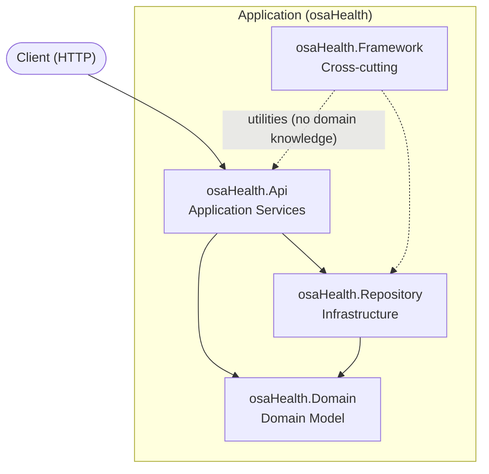
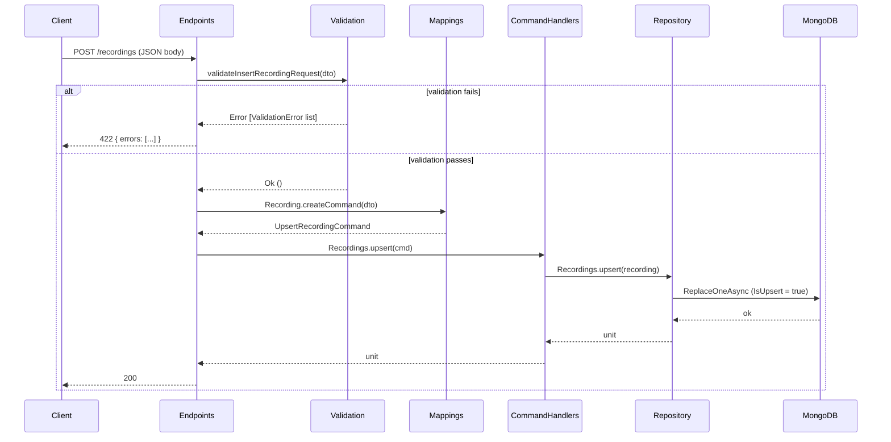

# Architecture Overview

osaHealth follows **Onion Architecture**. If you are new to the pattern, read [onion-architecture.md](onion-architecture.md) first.



---

## Project-to-Layer Mapping

| Project | Onion Layer | Single Responsibility |
|---|---|---|
| `osaHealth.Framework` | Cross-cutting | JSON helpers, HTTP client, Dapr client, BDD test harness |
| `osaHealth.Domain` | Domain Model | Core types (`Recording`), UMX measure units (`RecordingId`, `UserId`) |
| `osaHealth.Repository` | Infrastructure | MongoDB documents, domain↔entity mapping, upsert operations |
| `osaHealth.Api` | Application Services | HTTP endpoints, request validation, CQRS commands, DI wiring |

---

## How a request flows through the system

A request enters at the **Infrastructure** layer — the HTTP framework (Oxpecker) receives it and routes it to the appropriate endpoint handler.

The endpoint handler lives in **Application Services**.

> osaHealth uses Onion rather than Clean Architecture, so there is no dedicated Interface Adapters ring. HTTP concerns (reading the request, writing the response) are handled directly in Application Services — Clean Architecture would isolate them in a separate ring.

The first thing the handler does is validate the incoming data: checking that required fields are present and that field constraints hold. If validation fails, a 422 is returned immediately and nothing else runs.

When validation passes, the input is mapped to a command — a plain data structure that names the intent (e.g. "upsert this recording") without any domain knowledge. A command handler in Application Services then takes over: it turns the command's data into a domain type and carries out the action — persisting to the database, publishing an event, calling an external service, or any combination of these through **Infrastructure**.

Control returns to the endpoint handler, which sends the 200 response. The Domain Model never knew the request existed.

---

## Request Flow: `POST /recordings`



---

## Key Patterns (the non-obvious bits)

### UMX Measure Types

`Guid<RecordingId>` and `string<UserId>` are phantom types — at runtime identical to `Guid` and `string`, but the compiler prevents passing a `UserId` where a `RecordingId` is expected.

**Rule:** Only applied at the domain and persistence layers. Commands and DTOs use plain `Guid` and `string` — the tagging happens once, in `CommandHandlers.fs`, as the command crosses into the domain.

### Why So Many Files in `osaHealth.Api`?

Single Responsibility. Each file does exactly one thing:
- `Validation.fs` validates — it does not map
- `Mappings.fs` maps — it does not validate
- `CommandHandlers.fs` orchestrates the domain step — it does not handle HTTP
- `Endpoints.fs` handles HTTP — it does not contain business logic

This makes each file testable in isolation and prevents rules from leaking across concerns.

### Function-Composition Dependency Injection

There is no IoC container. `DependencyInjection.fs` composes the handler stack by partial application:

```
MongoDB collection
  → partially applied into Repositories.Recordings.upsert    (persist layer)
  → partially applied into CommandHandlers.Recordings.upsert (orchestration layer)
  → partially applied into Endpoints.insertRecordingHandler  (HTTP layer)
  → EndpointHandler (a plain function)
```

No reflection, no attributes, no magic.

### F# Compilation Order

F# files must be declared in dependency order inside the `.fsproj`. If `Validation.fs` needs `RecordingDto` from `Models.fs`, then `Models.fs` must appear first in the `<ItemGroup>`. The order in `osaHealth.Api.fsproj` is not arbitrary — it is the dependency graph of the code.

### `Result<unit, ValidationError list>`

Validation returns `Ok ()` on success — not the DTO back. This is intentional: validation checks constraints but does not transform anything. If it also normalised data (trimmed strings, lowercased emails), it would return a richer type to carry proof that normalisation ran. Returning the same type unchanged would be a white lie.
