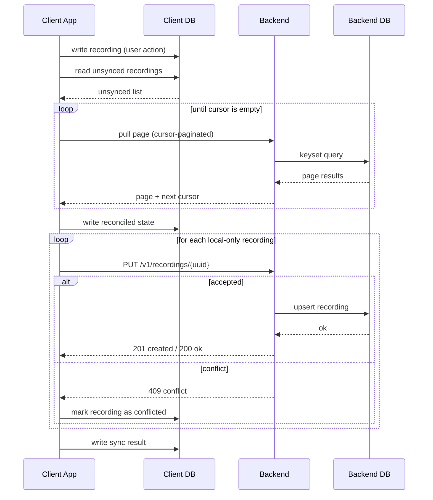
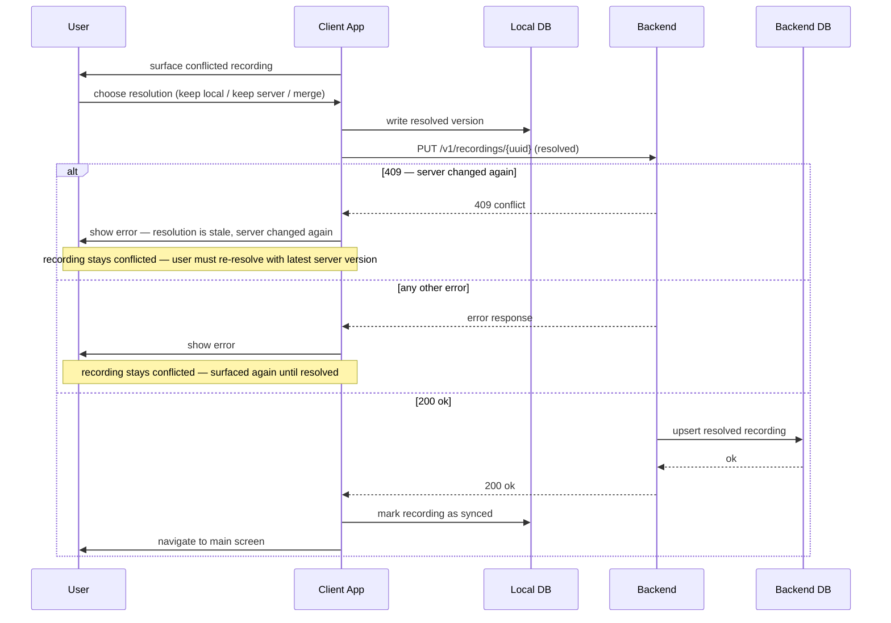
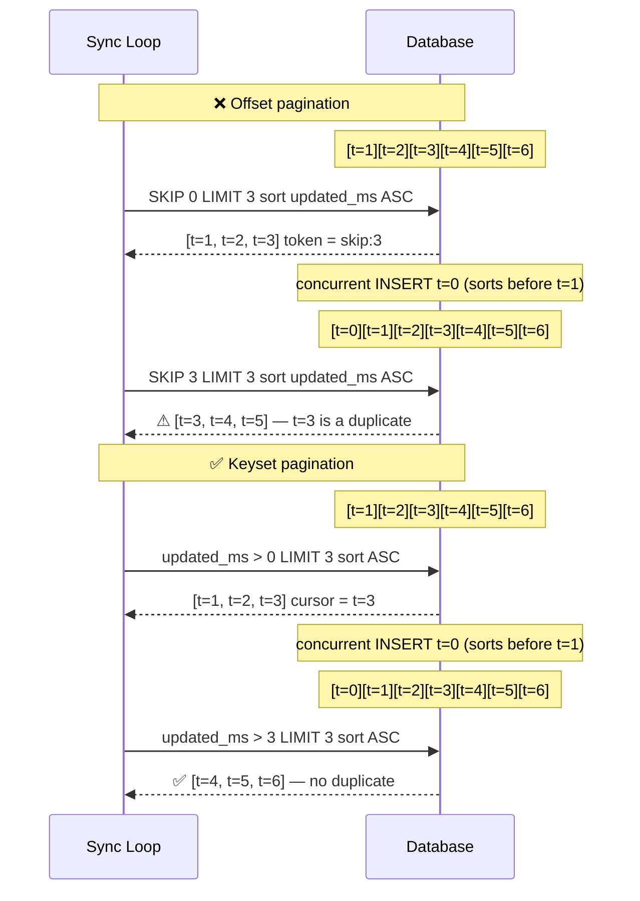

# Offline-First Sync in osaHealth

osaHealth is offline-first. A user can create and view recordings with no network connection. Syncing with the server happens in the background when connectivity is available, without interrupting the user.

This document explains the sync design: why the client owns record identities, how the sync loop works, and why stable cursor pagination is a hard requirement.

---

## Client-generated UUIDs

Every recording is assigned a UUID by the device at the moment it is created — before any server has seen it.

This is a direct consequence of offline-first. The device must write the recording to local storage immediately. If the server assigned IDs, the client could not create the local record until it had a network connection and a server response. That would break offline use entirely.

The UUID becomes the stable identity of the recording everywhere: local SQLite, server database, and sync loop. When the sync loop eventually pushes the recording to the server via `PUT /v1/recordings/{client-uuid}`, the server responds:

| Response | Meaning |
|----------|---------|
| `201 Created` | First time the server has seen this UUID — accepted. |
| `200 OK` | Already exists with identical content — idempotent replay, safe to retry. |
| [`409 Conflict`][409 Conflict] | Same UUID exists server-side with *different* content — user must resolve. |

The 409 case is why the ID must be client-owned. Conflict is detected by identity: same UUID, different body. That only works if the UUID was chosen by the client and is stable across retries. UUID v4 or v7 provides sufficient collision resistance for this purpose.

### Security [invariant] — UUID is an identifier, not proof of ownership

A malicious client could craft a `PUT /v1/recordings/{uuid}` targeting a UUID it guessed or harvested, attempting to overwrite another user's recording. UUID v4 makes guessing computationally infeasible, but entropy is a probabilistic defence. Authorization is the structural one.

**The server must always derive `userId` from the auth token — never from the request body or URL.** => see [authentication]

| Rule | Detail |
|------|--------|
| On `PUT /v1/recordings/{uuid}` | If the UUID already exists and its `userId` does not match the caller's token identity, return [`403`][403 Forbidden]. Not `409` (which confirms existence). |
| On all queries | Filter by `userId` from the token. Never accept `userId` as a client-supplied query parameter. |
| On ingestion | Validate UUID format. Reject malformed values before any storage interaction. |

With these three rules in place, a misbehaving client targeting a foreign UUID receives a `403` that reveals nothing. The UUID in the URL is a record identifier. The auth token is the proof of ownership.

---

## The sync loop

The sync loop runs in the background on the device. It has three phases:

1. **Pull** — page through server-side recordings for this user, sorted by `updated_ms ASC`, using cursor pagination. Apply any changes to local state.
2. **Reconcile** — compare the server view with local state; surface any 409 conflicts for user resolution.
3. **Push** — for each recording that exists locally but not on the server, issue `PUT /v1/recordings/{uuid}`.



SQLite/Drift is a passive store — it receives writes and answers reads, but never initiates communication. A 409 on one recording does not halt the loop — the conflict is recorded locally and the remaining recordings continue pushing.

### Conflict resolution

A conflicted recording requires user input. This is a separate, user-driven flow that runs after the sync loop completes.



---

## Why cursor pagination is a hard requirement

The pull phase reads pages of server-side recordings while other clients may be writing concurrently. This means the result set can change between pages. The pagination strategy must remain stable under concurrent inserts — a duplicate or silently skipped recording in the sync loop is a correctness bug.

### Offset pagination — unstable

Offset pagination works by position: "give me 3 rows, skip 3." If a new recording is inserted before the current page boundary while the client is mid-traversal, the offset shifts and a duplicate is delivered.

### Keyset (cursor) pagination — stable

Keyset pagination works by value: "give me the next 3 rows where `updated_ms > last_seen_value`." The cursor is a bookmark anchored to a field value, not a row position. Concurrent inserts behind the cursor boundary do not affect the result.



### Tie-breaking

If two recordings share the same `updated_ms` value, a simple `updated_ms > cursor` query will silently skip one of them. The compound cursor `(updated_ms, id)` handles this: MongoDB's `_id` (ObjectId) is inherently monotonic, so ties are broken by insertion order.

```javascript
db.recordings.find({
  userId: "user-A",
  $or: [
    { updated_ms: { $gt: lastCursor } },
    { updated_ms: lastCursor, _id: { $gt: lastId } }
  ]
}).sort({ updated_ms: 1, _id: 1 }).limit(N)
```

---

## References

- [ADR-0010](adr/0010-backend-database.md) — Query layer evaluation: Dapr State Store vs direct MongoDB.
- [ADR-0005](adr/0005-flutter-state-management.md) — Bloc state management; the `SyncBloc` owns sync state atomically.

[invariant]: glossary.md#invariant
[authentication]: adr/0015-authentication.md
[403 Forbidden]: glossary.md#403-Forbidden
[409 Conflict]: glossary.md#409-conflict